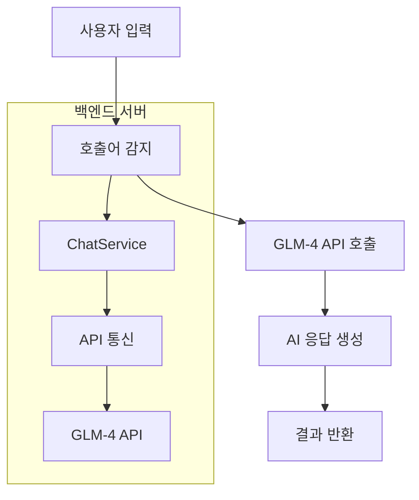

# KakaoTalk AI Agent (GLM Powered)

<p align="center">
  
  
</p>

<p align="center">
  <a href="https://nestjs.com/" target="_blank" rel="noreferrer">
    
  </a>
  <a href="https://www.typescriptlang.org/" target="_blank" rel="noreferrer">
    
  </a>
  <a href="https://glm.ai/" target="_blank" rel="noreferrer">
    
  </a>
  <a href="https://www.electronjs.org/" target="_blank" rel="noreferrer">
    
  </a>
</p>

<p align="center">
  <em>GLM-4 API를 활용하여 카카오톡 메시지에 지능적으로 반응하는 미니멀한 AI 봇 백엔드</em>
</p>

<p align="center">
  <a href="https://github.com/your-username/msgbot_glm_kakao/actions">
    
  </a>
  <a href="https://www.npmjs.com/package/msgbot_glm_kakao">
    
  </a>
  <a href="https://github.com/your-username/msgbot_glm_kakao/blob/main/LICENSE">
    
  </a>
</p>

---

## 📋 프로젝트 개요

이 프로젝트는 **카카오톡 메시지에 지능적으로 반응하는 AI 봇 백엔드**입니다. GLM-4 AI 모델을 활용하여 사용자의 질문에 자연스럽게 답변하며, "코비서"라는 호출어를 통해 활성화됩니다.

### 주요 특징

- **지능형 대화**: GLM-4 AI를 통해 자연스러운 한국어 응답 생성
- **미니멀 아키텍처**: 데이터베이스 없이 가볍고 빠르게 동작
- **NestJS 기반**: 확장 가능하고 견고한 백엔드 구조
- **실시간 개발**: Hot Reload 지원
- **CORS 지원**: 다양한 클라이언트 환경에서 사용 가능

## 🏗️ 아키텍처



### 컴포넌트 구조

```
src/
├── main.ts          # 애플리케이션 진입점
└── (단일 파일 모드)
```

## 📦 설치 및 실행

### 1. 사전 요구사항

- Node.js 18.x 이상
- npm 8.x 이상
- GLM API 키 (z.ai에서 발급)

### 2. 프로젝트 클론

```bash
git clone https://github.com/your-username/msgbot_glm_kakao.git
cd msgbot_glm_kakao
```

### 3. 의존성 설치

```bash
npm install
```

### 4. 환경 변수 설정

프로젝트 루트에 `.env` 파일을 생성하고 다음 내용을 추가합니다:

```env
# GLM API 인증 정보
GLM_API_KEY="your_glm_api_key_here"
GLM_BASE_URL="https://api.z.ai/api/coding/paas/v4"
GLM_MODEL="GLM-4-Plus"
GLM_TEMPERATURE="0.2"

# 서버 포트 설정
PORT=3001

# 로그 레벨 설정 (옵션)
LOG_LEVEL="info"
```

### 5. 서버 실행

#### 개발 모드 (Hot Reload)

```bash
npm run start:dev
```

#### 프로덕션 빌드 및 실행

```bash
npm run build
npm run start:prod
```

## 📡 API 엔드포인트

### 1. 상태 확인

```http
GET /
```

**응답:**
```json
{
  "status": "ok",
  "message": "코비서 AI 서버 작동 중 (Single File Mode)",
  "version": "1.0.0"
}
```

### 2. 메시지 처리

```http
POST /chat/process
Content-Type: application/json

{
  "message": "코비서, 오늘 날씨 어때?"
}
```

**응답:**
```json
{
  "summary": "오늘 서울의 날씨는 맑고 따뜻합니다. 오후에는 25도까지 올라갈 예정이니 가벼운 옷차림이 좋겠네요."
}
```


## ⚙️ 설정 옵션

### 환경 변수

| 변수명 | 설명 | 기본값 |
|--------|------|--------|
| `GLM_API_KEY` | GLM API 인증 키 | - |
| `GLM_BASE_URL` | GLM API 기본 URL | `https://api.z.ai/api/coding/paas/v4` |
| `GLM_MODEL` | 사용할 GLM 모델 | `GLM-4-Plus` |
| `GLM_TEMPERATURE` | 응답의 창의성 정도 (0-1) | `0.2` |
| `PORT` | 서버 포트 번호 | `3001` |
| `LOG_LEVEL` | 로그 레벨 | `info` |

## 🔧 개발 가이드

### 코드 구조

```
src/main.ts
├── ChatService       # AI 통신 및 메시지 처리 로직
├── AppController     # API 엔드포인트 정의
└── AppModule        # 애플리케이션 모듈
```

### 주요 클래스

#### ChatService
- GLM-4 API와의 통신 담당
- 호출어 기반 메시지 처리
- AI 응답 생성 로직
- **상세 로그 시스템**: 데이터 흐름 실시간 모니터링

#### AppController
- HTTP 요청 처리
- API 엔드포인트 제공
- CORS 설정

## 📊 로그 시스템

### 실시간 데이터 모니터링

서버 실행 시 터미널에 다음과 같은 상세 로그가 출력됩니다:

```
┌── [AI API Request] ──────────────────────────
│ Model: GLM-4-Plus
│ Messages: [{"role":"user","content":"너는 '코비서'라는 이름의 친절한 AI 비서야. 한국어로 자연스럽게 간결하게(3문장 이내) 답변해줘. 사용자 질문: \"오늘 날씨 어때?\""}]
└──────────────────────────────────────────────

🔍 [Analysis]: 호출어 감지됨 -> 쿼리: "오늘 날씨 어때?"

┌── [AI API Response] ─────────────────────────
│ Content: 오늘 서울의 날씨는 맑고 따뜻합니다. 오후에는 25도까지 올라갈 예정이니 가벼운 옷차림이 좋겠네요.
└──────────────────────────────────────────────
```

### 로그 종류

| 로그 유형 | 설명 | 출력 예시 |
|----------|------|----------|
| **AI API Request** | GLM-4 API 호출 정보 | 모델, 메시지 내용 |
| **AI API Response** | AI 응답 결과 | 생성된 응답 내용 |
| **Analysis** | 메시지 분석 결과 | 호출어 감지, 쿼리 내용 |
| **Error** | API 오류 정보 | 오류 메시지 |

### Android Emulator 통신

안드로이드 에뮬레이터와 호스트 PC 간의 통신을 위해 전용 IP(10.0.2.2)를 사용하도록 구성되어 있습니다. 이를 통해 에뮬레이터에서 서버에 안정적으로 접속할 수 있습니다.

## 🧪 테스트

프로젝트에는 기본 테스트 스크립트가 포함되어 있지 않습니다. 필요시 Jest나 Mocha를 추가하여 테스트를 구현할 수 있습니다.

## 📝 기여 가이드

기여를 원하시면 다음 단계를 따라주세요:

1. 이 리포지토리를 포크합니다
2. 새 브랜치를 생성합니다 (`git checkout -b feature/AmazingFeature`)
3. 변경 사항을 커밋합니다 (`git commit -m 'Add some AmazingFeature'`)
4. 브랜치에 푸시합니다 (`git push origin feature/AmazingFeature`)
5. 풀 리퀘스트를 엽니다

## 📄 라이선스

이 프로젝트는 **MIT 라이선스**를 따릅니다.

```text
MIT License

Copyright (c) 2026 Coreline AI

Permission is hereby granted, free of charge, to any person obtaining a copy
of this software and associated documentation files (the "Software"), to deal
in the Software without restriction, including without limitation the rights
to use, copy, modify, merge, publish, distribute, sublicense, and/or sell
copies of the Software, and to permit persons to whom the Software is
furnished to do so, subject to the following conditions:

The above copyright notice and this permission notice shall be included in all
copies or substantial portions of the Software.

THE SOFTWARE IS PROVIDED "AS IS", WITHOUT WARRANTY OF ANY KIND, EXPRESS OR
IMPLIED, INCLUDING BUT NOT LIMITED TO THE WARRANTIES OF MERCHANTABILITY,
FITNESS FOR A PARTICULAR PURPOSE AND NONINFRINGEMENT. IN NO EVENT SHALL THE
AUTHORS OR COPYRIGHT HOLDERS BE LIABLE FOR ANY CLAIM, DAMAGES OR OTHER
LIABILITY, WHETHER IN AN ACTION OF CONTRACT, TORT OR OTHERWISE, ARISING FROM,
OUT OF OR IN CONNECTION WITH THE SOFTWARE OR THE USE OR OTHER DEALINGS IN THE
SOFTWARE.
```

자세한 내용은 [LICENSE](LICENSE) 파일을 참조하세요.

## 🤝 지원

프로젝트에 대한 문의 사항이나 문제 보고는 이슈 트래커를 통해 연락주세요.

---

<p align="center">
  Made with ❤️ by Your Name | <a href="https://github.com/your-username">GitHub</a>
</p>
