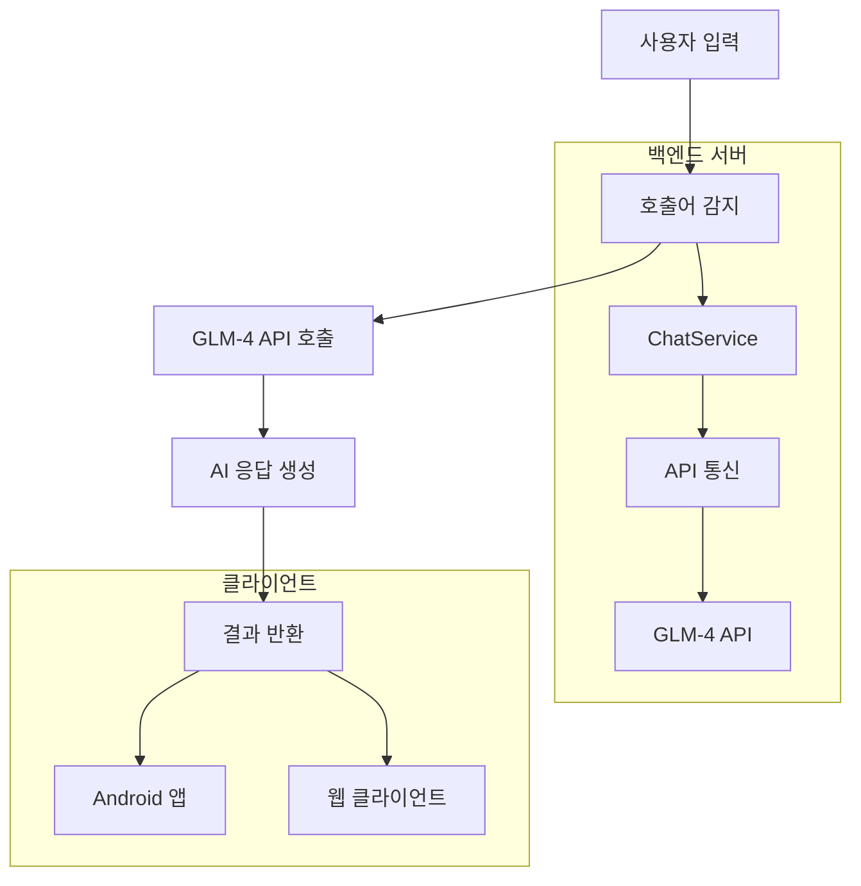

# 코비서 AI 봇 - 기술 요구 사항 문서 (TRD)

## 📋 문서 정보

- **문서 버전**: 1.0.0
- **작성일**: 2026-02-05
- **작성자**: 기술 팀
- **최종 수정일**: 2026-02-05
- **상태**: Draft

## 🏗️ 시스템 아키텍처

### 1.1 전체 아키텍처 다이어그램



### 1.2 기술 스택

| 구성 요소 | 기술 | 버전 | 설명 |
|----------|------|------|------|
| **백엔드 프레임워크** | NestJS | 11.0.1 | TypeScript 기반의 확장 가능한 서버 프레임워크 |
| **프로그래밍 언어** | TypeScript | 5.7.3 | 정적 타입 지원 및 현대적인 JavaScript |
| **HTTP 클라이언트** | Axios | 1.9.0 | Promise 기반 HTTP 통신 라이브러리 |
| **AI 엔진** | GLM-4 API | - | 지능형 대화 생성 |
| **데이터 형식** | JSON | - | 표준 데이터 교환 형식 |
| **빌드 도구** | Nest CLI | 11.0.0 | 프로젝트 생성 및 관리 |
| **컴파일러** | SWC | 1.10.7 | 빠른 TypeScript 컴파일링 |

## 📁 프로젝트 구조

### 2.1 디렉토리 구조

```
msgbot_glm_kakao-main/
├── src/                    # 소스 코드 디렉토리
│   └── main.ts             # 메인 애플리케이션 파일 (단일 파일 모드)
├── android_client/         # 안드로이드 클라이언트 앱
├── docs/                  # 문서 디렉토리
│   ├── PRD.md             # 제품 요구 사항 문서
│   └── TRD.md             # 기술 요구 사항 문서 (현재 파일)
├── package.json           # 프로젝트 의존성 및 스크립트
├── tsconfig.json          # TypeScript 설정
├── tsconfig.build.json    # 빌드용 TypeScript 설정
├── nest-cli.json         # NestJS CLI 설정
└── .env*                 # 환경 변수 설정 파일
```

### 2.2 코드 구조 (단일 파일 모드)

```
src/main.ts
├── ChatService       # AI 통신 및 메시지 처리 로직
│   ├── callGlmApi()    # GLM-4 API 호출 메서드
│   ├── processMessage() # 메시지 처리 메서드
│   └── generateChatResponse() # AI 응답 생성 메서드
├── AppController     # API 엔드포인트 정의
│   ├── healthCheck()  # 상태 확인 엔드포인트
│   ├── process()     # 메시지 처리 엔드포인트
│   └── getHistory()  # 채팅 기록 조회 엔드포인트
└── AppModule        # 애플리케이션 모듈
    ├── ConfigModule  # 환경 변수 설정
    ├── controllers   # 컨트롤러 등록
    └── providers     # 서비스 등록
```

## 🔧 핵심 컴포넌트 상세

### 3.1 ChatService 클래스

#### 3.1.1 주요 메서드

```typescript
@Injectable()
class ChatService {
  private readonly WAKE_WORD = '코비서';

  // GLM-4 API 호출을 위한 저수준 메서드
  private async callGlmApi(messages: any[], temperature?: number): Promise<string | null>

  // 메시지 입력을 분석하여 호출어 기반 응답 생성
  async processMessage(message: string): Promise<{ summary: string } | null>

  // AI 응답 생성을 위한 프롬프트 구성
  private async generateChatResponse(query: string): Promise<string | null>
}
```

#### 3.1.2 데이터 흐름

```
입력 메시지 → 호출어 확인 → 쿼리 추출 → 프롬프트 생성 → GLM-4 API 호출 → 응답 처리 → 결과 반환
```

#### 3.1.3 로그 시스템

```typescript
// API 요청 로그
console.log('\n┌── [AI API Request] ──────────────────────────');
console.log(`│ Model: ${this.configService.get<string>('GLM_MODEL') || 'GLM-4-Plus'}`);
console.log(`│ Messages: ${JSON.stringify(messages, null, 2).split('\n').join('\n│ ')}`);
console.log('└──────────────────────────────────────────────');

// API 응답 로그
console.log('┌── [AI API Response] ─────────────────────────');
console.log(`│ Content: ${reply?.split('\n').join('\n│ ')}`);
console.log('└──────────────────────────────────────────────\n');

// 분석 로그
console.log(`\n🔍 [Analysis]: 호출어 감지됨 -> 쿼리: "${query}"`);
```

### 3.2 AppController 클래스

#### 3.2.1 엔드포인트 정의

```typescript
@Controller()
class AppController {
  // 서버 상태 확인
  @Get()
  healthCheck(): { status: string; message: string; version: string }

  // 메시지 처리 API
  @Post('chat/process')
  async process(@Body() body: { message: string }): Promise<{ summary: string } | null>

}
```

#### 3.2.2 CORS 설정

```typescript
app.enableCors({
  origin: true,
  credentials: true
});
```

### 3.3 AppModule 클래스

#### 3.3.1 모듈 구성

```typescript
@Module({
  imports: [
    ConfigModule.forRoot({
      isGlobal: true,
      envFilePath: path.resolve(__dirname, '../.env'),
    }),
  ],
  controllers: [AppController],
  providers: [ChatService],
})
class AppModule { }
```

## 📡 API 명세 상세

### 4.1 엔드포인트 상세

#### 4.1.1 상태 확인

```
GET /
```

**응답**:
```json
{
  "status": "ok",
  "message": "코비서 AI 서버 작동 중 (Single File Mode)",
  "version": "1.0.0"
}
```

#### 4.1.2 메시지 처리

```
POST /chat/process
Content-Type: application/json

{
  "message": "코비서, 오늘 날씨 어때?"
}
```

**응답**:
```json
{
  "summary": "오늘 서울의 날씨는 맑고 따뜻합니다. 오후에는 25도까지 올라갈 예정이니 가벼운 옷차림이 좋겠네요."
}
```


## ⚙️ 환경 변수 설정

### 5.1 환경 변수 목록

| 변수명 | 타입 | 기본값 | 설명 | 필수 여부 |
|--------|------|--------|------|----------|
| `GLM_API_KEY` | string | - | GLM API 인증 키 | ✅ |
| `GLM_BASE_URL` | string | `https://api.z.ai/api/coding/paas/v4` | GLM API 기본 URL | ⚠️ |
| `GLM_MODEL` | string | `GLM-4-Plus` | 사용할 GLM 모델 | ⚠️ |
| `GLM_TEMPERATURE` | string | `0.2` | 응답의 창의성 정도 (0-1) | ⚠️ |
| `PORT` | string | `3001` | 서버 포트 번호 | ⚠️ |
| `LOG_LEVEL` | string | `info` | 로그 레벨 | ⚠️ |

### 5.2 환경 파일 구조

```
# .env 파일 예시
GLM_API_KEY="your_api_key_here"
GLM_BASE_URL="https://api.z.ai/api/coding/paas/v4"
GLM_MODEL="GLM-4-Plus"
GLM_TEMPERATURE="0.2"
PORT="3001"
LOG_LEVEL="info"
```

## 🛠️ 빌드 및 배포

### 6.1 개발 모드 실행

```bash
npm run start:dev
```

- **특징**: Hot Reload 지원
- **포트**: 3001
- **CORS**: 모든 출처 허용
- **로그**: 상세 로그 출력

### 6.2 프로덕션 빌드

```bash
npm run build
npm run start:prod
```

- **빌드 명령**: `nest build`
- **실행 명령**: `node dist/main`
- **최적화**: 프로덕션 모드 설정

### 6.3 Docker 지원 (예정)

```dockerfile
# Dockerfile 예시 (미구현)
FROM node:18-alpine
WORKDIR /app
COPY package*.json ./
RUN npm install --production
COPY . .
EXPOSE 3001
CMD ["npm", "run", "start:prod"]
```

## 📊 로그 시스템 상세

### 7.1 로그 레벨

| 레벨 | 설명 | 출력 예시 |
|------|------|----------|
| **info** | 일반 정보 로그 | 서버 시작, API 호출 |
| **error** | 오류 정보 로그 | API 실패, 시스템 오류 |
| **debug** | 디버그 정보 로그 | 상세 처리 과정 |

### 7.2 로그 출력 형식

```
┌── [AI API Request] ──────────────────────────
│ Model: GLM-4-Plus
│ Messages: [{"role":"user","content":"너는 '코비서'라는 이름의 친절한 AI 비서야. 한국어로 자연스럽게 간결하게(3문장 이내) 답변해줘. 사용자 질문: \"오늘 날씨 어때?\""}]
└──────────────────────────────────────────────

🔍 [Analysis]: 호출어 감지됨 -> 쿼리: "오늘 날씨 어때?"

┌── [AI API Response] ─────────────────────────
│ Content: 오늘 서울의 날씨는 맑고 따뜼합니다. 오후에는 25도까지 올라갈 예정이니 가벼운 옷차림이 좋겠네요.
└──────────────────────────────────────────────
```

### 7.3 로그 종류

| 로그 유형 | 설명 | 출력 예시 |
|----------|------|----------|
| **AI API Request** | GLM-4 API 호출 정보 | 모델, 메시지 내용 |
| **AI API Response** | AI 응답 결과 | 생성된 응답 내용 |
| **Analysis** | 메시지 분석 결과 | 호출어 감지, 쿼리 내용 |
| **Error** | API 오류 정보 | 오류 메시지 |

## 📱 클라이언트 연동

### 8.1 Android 에뮬레이터 통신

#### 8.1.1 연결 방법

```kotlin
// Android Kotlin 예시
val apiService = Retrofit.Builder()
    .baseUrl("http://10.0.2.2:3001/")
    .build()
    .create(ApiService::class.java)
```

#### 8.1.2 CORS 처리

```typescript
// 서버 측 CORS 설정
app.enableCors({
  origin: true,
  credentials: true
});
```

### 8.2 API 호출 예시

```javascript
// JavaScript 예시
fetch('http://10.0.2.2:3001/chat/process', {
  method: 'POST',
  headers: {
    'Content-Type': 'application/json',
  },
  body: JSON.stringify({
    message: '코비서, 오늘 날씨 어때?'
  })
})
.then(response => response.json())
.then(data => console.log(data));
```

## 🔒 보안 고려사항

### 9.1 API 키 관리

- **환경 변수 사용**: API 키는 환경 변수로 관리
- **저장 위치**: `.env` 파일 (Gitignore 포함)
- **접근 제어**: 서버 외부로의 API 키 노출 방지

### 9.2 데이터 보안

- **데이터베이스 미사용**: 민감 정보 저장 방지
- **데이터 전송**: HTTPS를 통한 안전한 데이터 전송
- **입력 검증**: 사용자 입력에 대한 기본적인 검증

## 🧪 테스트 전략

### 10.1 테스트 종류

#### 10.1.1 단위 테스트

```typescript
// ChatService 테스트 예시
describe('ChatService', () => {
  let service: ChatService;

  beforeEach(() => {
    const module: TestingModule = Test.createTestingModule({
      providers: [ChatService],
    }).compile();

    service = module.get<ChatService>(ChatService);
  });

  it('should be defined', () => {
    expect(service).toBeDefined();
  });

  it('should process message with wake word', async () => {
    const result = await service.processMessage('코비서, 안녕');
    expect(result).not.toBeNull();
  });
});
```

#### 10.1.2 통합 테스트

```typescript
// API 엔드포인트 테스트 예시
describe('AppController', () => {
  let app: INestApplication;

  beforeEach(async () => {
    const moduleFixture: TestingModule = await Test.createTestingModule({
      controllers: [AppController],
      providers: [ChatService],
    }).compile();

    app = moduleFixture.createNestApplication();
    await app.init();
  });

  it('/ (GET)', () => {
    return request(app.getHttpServer())
      .get('/')
      .expect(200)
      .expect({ status: 'ok', message: '코비서 AI 서버 작동 중' });
  });
});
```

### 10.2 테스트 환경

- **테스트 프레임워크**: Jest
- **테스트 데이터베이스**: 테스트용 데이터베이스 (미구현)
- **테스트 커버리지**: 80% 이상 목표

## 📈 성능 최적화

### 11.1 성능 목표

- **응답 시간**: 2초 이내
- **처리량**: 분당 60회 요청
- **메모리 사용**: 100MB 이내
- **CPU 사용**: 1코어 50% 이내

### 11.2 최적화 전략

- **캐싱**: API 응답 캐싱 (미구현)
- **비동기 처리**: 비동기 API 호출
- **리소스 관리**: 메모리 누수 방지
- **로드 밸런싱**: 다중 인스턴스 배포 (미구현)

## 📝 문서화 전략

### 12.1 코드 문서화

- **JSDoc**: TypeScript 클래스 및 메서드 문서화
- **README.md**: 프로젝트 개요 및 설치 방법
- **PRD.md**: 제품 요구 사항 문서
- **TRD.md**: 기술 요구 사항 문서 (현재 파일)

### 12.2 API 문서화

- **Swagger/OpenAPI**: API 명세 자동 생성 (미구현)
- **API 테스트**: Postman 컬렉션 제공 (미구현)

## 🚀 확장성 고려사항

### 13.1 미래 기능 추가

- **채팅 기록 저장**: 데이터베이스 추가 (미구현)
- **사용자 인증**: 인증 시스템 구현 (미구현)
- **다국어 지원**: 다국어 모델 추가 (미구현)
- **고급 분석**: 분석 기능 추가 (미구현)

### 13.2 모듈화 설계

- **컴포넌트 분리**: 기능별 모듈 분리 가능
- **플러그인 아키텍처**: 확장 가능한 설계
- **의존성 주입**: 유연한 의존성 관리

## 📅 배포 전략

### 14.1 배포 환경

- **개발 환경**: 로컬 개발 머신
- **테스트 환경**: Staging 서버
- **프로덕션 환경**: 클라우드 서버

### 14.2 배포 프로세스

```bash
# 빌드
npm run build

# 배포
scp -r dist/ user@server:/path/to/app
ssh user@server "cd /path/to/app && npm install --production && pm2 start main.js"
```

### 14.3 모니터링

- **로그 모니터링**: 서버 로그 실시간 확인
- **성능 모니터링**: CPU, 메모리 사용량 모니터링
- **알림 시스템**: 이상 감지 시 알림 (미구현)

### 14.4 Android 클라이언트 개발

#### 14.4.1 앱 아키텍처
- **Clean Architecture**: Domain, Data, Presentation 레이어 분리
- **모듈화 설계**: 기능별 모듈 분리 가능
- **의존성 주입**: Kotlin DI를 통한 유연한 의존성 관리

#### 14.4.2 기술 스택
| 구성 요소 | 기술 | 버전 | 설명 |
|----------|------|------|------|
| **프로그래밍 언어** | Kotlin | 1.9+ | 현대적인 JVM 언어 |
| **HTTP 클라이언트** | Retrofit | 2.9+ | 타입-safe HTTP 클라이언트 |
| **비동기 프로그래밍** | Coroutines | 1.7+ | 비동기 작업 처리 |
| **의존성 주입** | Koin | 3.4+ | 경량 DI 프레임워크 |
| **UI 프레임워크** | Jetpack Compose | 1.5+ | 현대적인 UI 툴킷 |
| **알림 처리** | NotificationListenerService | - | 시스템 알림 가로채기 |

#### 14.4.3 주요 컴포넌트

```kotlin
// MyNotificationService - 알림 처리 서비스
class MyNotificationService : NotificationListenerService() {
    override fun onNotificationPosted(sbn: StatusBarNotification) {
        // 알림 메시지 처리 로직
    }
}

// RetrofitClient - API 클라이언트
interface ApiService {
    @POST("chat/process")
    suspend fun processMessage(@Body request: ChatRequest): ChatResponse
}

// UI 레이어 - Terminal UI 구현
@Composable
fun TerminalScreen() {
    // 해커 감성의 블랙 & 그린 테마 UI
}
```

#### 14.4.4 개발 가이드

**프로젝트 설정**:
```bash
# Android Studio에서 android_client 폴더를 프로젝트로 열기
# RetrofitClient.kt 파일에서 BASE_URL 수정
private const val BASE_URL = "http://192.168.x.x:3001/"
```

**알림 접근 권한**:
```xml
<!-- AndroidManifest.xml -->
<service
    android:name=".MyNotificationService"
    android:permission="android.permission.BIND_NOTIFICATION_LISTENER_SERVICE">
    <intent-filter>
        <action android:name="android.service.notification.NotificationListenerService" />
    </intent-filter>
</service>
```

**네트워크 설정**:
```kotlin
// 네트워크 타임아웃 설정 (60초)
val timeout = 60L
val client = OkHttpClient.Builder()
    .connectTimeout(timeout, TimeUnit.SECONDS)
    .readTimeout(timeout, TimeUnit.SECONDS)
    .writeTimeout(timeout, TimeUnit.SECONDS)
    .build()
```

#### 14.4.5 테스트 전략

- **단위 테스트**: ViewModel, UseCase 테스트
- **통합 테스트**: 네트워크 통신 테스트
- **UI 테스트**: Compose UI 테스트
- **알림 테스트**: 알림 처리 흐름 테스트

### 14.5 버전 1.3.0 (계획)

- **기능**: 실시간 알림 처리
- **기능**: 다중 장치 지원
- **기능**: 고급 사용자 인터페이스